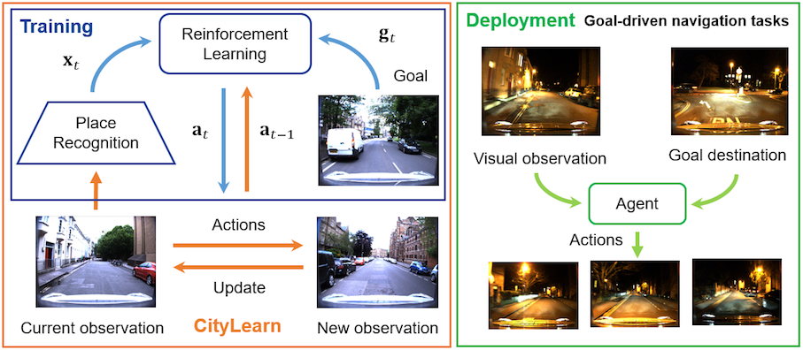

# CityLearn



In this release we provide our CityLearn (beta) environment implementation proposed in [**From Visual Place Recognition to Navigation: Learning Sample-Efficient Control Policies across Diverse Real World Environments**](https://arxiv.org/pdf/1910.04335.pdf), accepted for publication in the IEEE International Conference on Robotics and Automation (ICRA 2020), Paris, France. Preprint version available at https://arxiv.org/abs/1910.04335.

## About

CityLearn is an interactive open framework for training and testing navigation algorithms over real-world environments including extreme visual appearance changes such as day to night or summer to winter transitions. We leverage publicly available datasets, often used in visual place recogntion and autonomous vehicles research, consisting of multiple traversals of across different seasons, time of day or weather conditions. It is designed to test generalization capabilities of navigation algorithms including reinforcement learning agents.

## Abstract

Visual navigation tasks in real world environments often require both self-motion and place recognition feedback. While deep reinforcement learning has shown success in solving these perception and decision-making problems in an end-to-end manner, these algorithms require large amounts of experience to learn navigation policies from high-dimensional inputs, which is generally impractical for real robots due to sample complexity. In this paper, we address these problems with two main contributions. We first leverage place recognition and deep learning techniques combined with goal destination feedback to generate compact, bimodal images representations that can then be used to effectively learn control policies at kilometer scale from a small amount of experience. Second, we present an interactive and realistic framework, called CityLearn, that enables for the first time the training of navigation algorithms across city-sized, real-world environments with extreme environmental changes. CityLearn features over 10 benchmark real-world datasets often used in place recognition research with more than 100 recorded traversals and across 60 cities around the world. We evaluate our approach in two CityLearn environments where our navigation policy is trained using a single traversal. Results show our method can be over 2 orders of magnitude faster than when using raw images and can also generalize across extreme visual changes including day to night and summer to winter transitions.

## Installation

### Requirements

The CityLearn environment is developed on top of the Unity ML-Agents, which runs on Mac OS X, Windows, or Linux.

Dependencies:

* Python 3.6
* Unity game engine
* Unity ML-Agents framework

### Download and Install the Requirements

1. Download Unity 2017.4 or above from https://store.unity.com/download or through UnityHub.

2. Download and follow the setup instructions of [Unity ML-Agents v0.10.0](https://github.com/Unity-Technologies/ml-agents/releases/tag/0.10.0) https://github.com/Unity-Technologies/ml-agents. We recommend to use v0.10.0 as we develod CityLearn using that version and also because new versions present substantial changes that might not work with out current release.

3. Download the CityLearn Environment:

  ```bash
  $ git clone https://github.com/mchancan/citylearn.git
  ```
  
  * Put the `CityLearnBeta` folder inside `UnitySDK/Assets/ML-Agents/Examples/` in your `ml-agents` folder.

## License

CityLearn itself is released under the MIT License (refer to the LICENSE file for details).

## Citation

If you find this project useful for your research, please use the following BibTeX entry.

	@inproceedings{
    CityLearn2020,
  	author = {M. {Chanc\'an}, and M. J. {Milford}},
  	booktitle={2020 IEEE International Conference on Robotics and Automation (ICRA)}, 
	  title={From Visual Place Recognition to Navigation: Learning Sample-Efficient Control Policies across Diverse Real World Environments}, 
	  year={2020}, 
	  volume={}, 
	  number={}, 
	  pages={1-8}, 
	  keywords={Visual-Based Navigation; Visual Learning; Deep Learning in Robotics and Automation},
	  doi={},
	  ISSN={},
	  month={May}}
