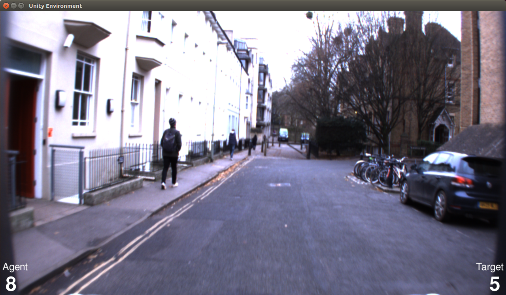
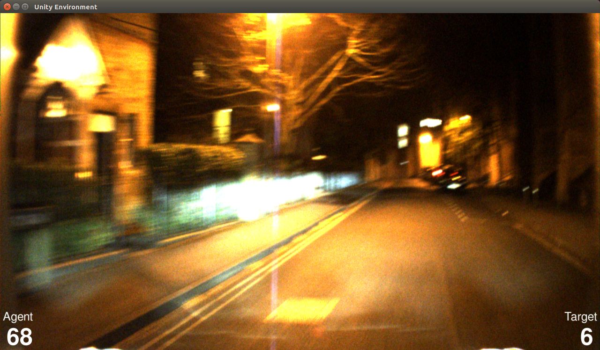
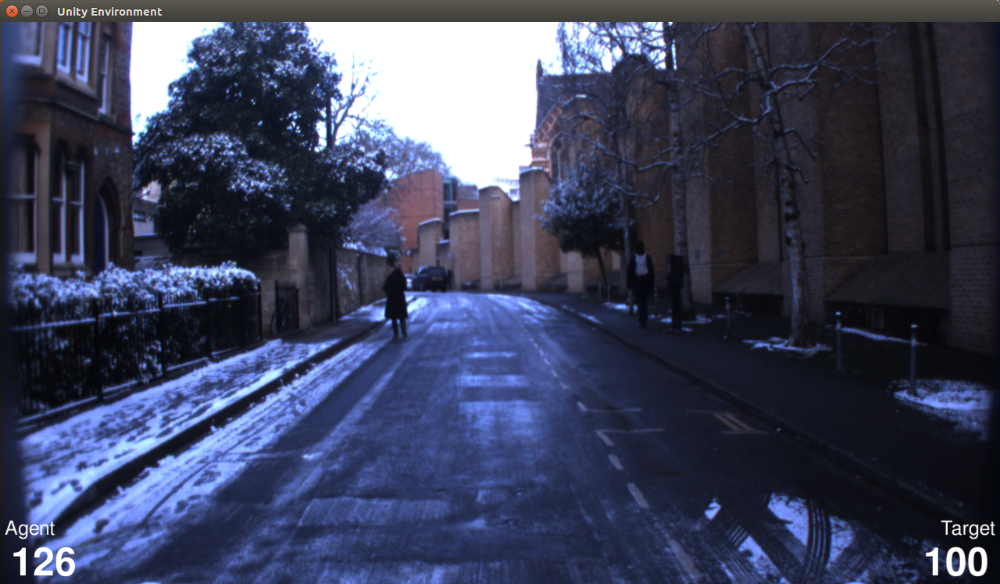

# CityLearn: Diverse Real-World Environments for Sample-Efficient Navigation Policy Learning

  

In this release we provide our **CityLearn** (beta) environment implementation proposed in [**CityLearn: Diverse Real-World Environments for Sample-Efficient Navigation Policy Learning**](https://arxiv.org/pdf/1910.04335.pdf), accepted for publication in the IEEE International Conference on Robotics and Automation (ICRA 2020). Preprint version available at https://arxiv.org/abs/1910.04335.

Project page: https://mchancan.github.io/projects/CityLearn

## About CityLearn

CityLearn is an interactive open framework for training and testing navigation algorithms on real-world environments with extreme visual appearance changes including day to night or summer to winter transitions. We leverage publicly available datasets, often used in visual place recognition and autonomous vehicles research, consisting of multiple traversals across different seasons, time of day or weather conditions. CityLearn is also designed to test the generalization capabilities of navigation algorithms including reinforcement learning agents.

## Installation

### Requirements

CityLearn is developed on top of the Unity ML-Agents toolkit, which runs on Mac OS X, Windows, or Linux.

Dependencies:

* Python 3.6
* Unity game engine
* Unity ML-Agents toolkit

### Download and install the requirements

1. Download [Unity](https://unity.com/products/core-platform) 2017.4 or above from https://unity3d.com/get-unity/download/archive or through [UnityHub](https://store.unity.com/download).

2. Download and follow the setup instructions of [Unity ML-Agents](https://github.com/Unity-Technologies/ml-agents) (recommended [v0.8.1](https://github.com/Unity-Technologies/ml-agents/releases/tag/0.8.1)). We recommend to use v0.8.1 as CityLearn is developed on that version and also because newer releases present substantial changes that might require additional [changes](https://github.com/Unity-Technologies/ml-agents/blob/master/docs/Migrating.md).

3. Download CityLearn **(the CityLearnBeta folder will be uploaded soon!)**

	```bash
	git clone https://github.com/mchancan/citylearn.git
	```
  
4. Put the `CityLearnBeta` directory inside `UnitySDK/Assets/ML-Agents/Examples/` in your `ml-agents` directory.

## License

CityLearn itself is released under the MIT License (refer to the LICENSE file for details) for academic purposes. For commercial usage, please contact us via `mchancanl@uni.pe`


## Citation

If you find this project useful for your research, please use the following BibTeX entry.

	@article{
		chancan2020citylearn,
		author = {M. {Chanc\'an} and M. {Milford}},
		title = {From Visual Place Recognition to Navigation: Learning Sample-Efficient Control Policies across Diverse Real World Environments},
		journal = {arXiv preprint arXiv:1910.04335},
		year = {2019}
	}
